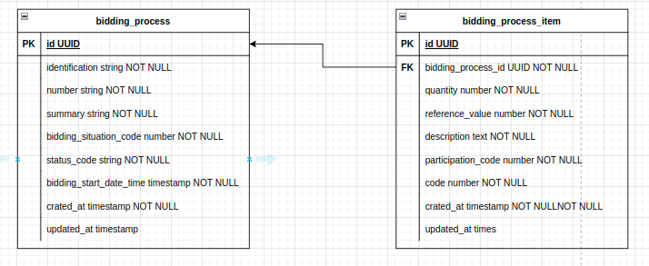

# [API] Aurora

Olá, eu sou [Robert](https://robertdeveloper.com/about), e estou muito contente em tê-lo aqui!

Este repositório contém a API do desafio técnico para a vaga de Desenvolvedor Back End - Botdesigner.

Antes de mais nada, gostaria de fazer um pequeno esclarecimento.

Primeiramente gostaria de parabenizar pelo desafio, ele é muito legal de ser resolvido. No entanto, devido a compromissos imprevistos ao longo da semana, não consegui dedicar o tempo contínuo e focado que gostaria para concluir todas as tarefas propostas.

Mesmo com pouco tempo creio que pude dar um norte de para onde o projeto de encaminhava, o que ficou faltando que creio que eu não tenha iniciado a montar foi a atualização dos itens de um processo, mas dando uma breve explicação, eu pretendia fazer o mesmo fluxo dos processos com uma preocupação a menos pois eu iria atualizar apenas os itens dos processos salvos em banco tendo em mente que os processos finalizados já haviam sido excluídos junto de seus itens no fluxo de processos.

Interessante pontuar que eu optei por não fazer uma classe para os processos e deixei o repository apenas com uma interface de o que seria o BiddingProcess pois ele é externo e não temos regras negociais suficientes.

Também é um ponto interessante a minha decisão de deixar o ObjectComparator na nossa camada de entidades, acabei deixando ela lá pois nosso sistema atualmente é focado exclusivamente nesta comparação de objetos então creio que seja uma regra negocial isolada para nosso sistema.
 
Para lidar com a atualização de 4h em 4h eu iria criar uma labda na aws que rodasse nos intervalos determinados chamando o endpoint, faria a criação desta lambda via [serverless](https://www.serverless.com/).

Este projeto ainda tem espaço para melhorias, e eu tinha várias ações planejadas em minha lista, tais como:

1. Documentação mais abrangente
2. Implementação de logs
3. Criação de middlewares para tratamento de erros
4. Ajustes no linting e no prettier
5. Integração com o Sentry
6. Aprimoramento do ambiente Docker para preparação ao deploy
7. Implementação do SonarQube
8. Integração com o Husky

Entendo que a lista de melhorias parece extensa para um desafio técnico, mas a minha intenção era criar um projeto completo que demonstrasse como é possível criar uma aplicação abrangente e escalável.

## Stack

Para desenvolver este projeto, utilizei as seguintes bibliotecas e frameworks:

- [NestJS](https://docs.nestjs.com/) - Framework NodeJS para aplicações server-side
- [TypeScript](https://www.typescriptlang.org/) - Linguagem fortemente tipada
- [Prisma ORM](https://www.prisma.io/nestjs) - Mapeamento objeto-relacional
- [ESLint](https://eslint.org/) - Analisador de código estático
- [Prettier](https://prettier.io/) - Formatador de código
- [Docker CE](https://www.docker.com/) - Plataforma para deploy e neste projeto utilizamos o docker-compose para criação dos serviços externos como banco
- [Jest](https://jestjs.io/pt-BR/docs/getting-started) - Framework de testes em JavaScript

## Arquitetura do projeto

Este projeto segue princípios de arquitetura limpa, CQRS, "ports and adapters", SOLID e TDD (comecei aplicando TDD, mas com o passar da semana vi que não iria dar para manter e teria que ser mais rápido o desenvolvimento).

## Arquitetura do Banco

Como eu não obtive resposta sobre minha pergunta eu imaginei que o desafio era conectar os canais de comunicações como Whatsapp, Twitter, Facebook e etc... A nossa API, fiz o ER pensando nisto.

<div align="center">
    
</div>

## Iniciando o Projeto

Siga os passos abaixo para iniciar o projeto:

### 1. Clonar o repositório

```
git clone git@github.com:RobertDS07/bidding_processes_extractor.git
```

### 2. Utilizar a versão correta do Node.js

Certifique-se de ter o [nvm](https://github.com/nvm-sh/nvm) instalado em sua máquina e execute os seguintes comandos:

```
nvm install

nvm use
```

### 3. Instalar as dependências

Utilize o [yarn](https://yarnpkg.com/):

```
yarn
```

### 4. Executar o projeto

Para iniciar o projeto, certifique-se de ter o [docker-compose](https://docs.docker.com/compose/install/) instalado em sua máquina e execute o seguinte comando:

```
yarn start:dev
```

Fique à vontade para explorar o projeto e não hesite em entrar em contato caso tenha alguma pergunta ou feedback. Espero que gostem do que consegui desenvolver dentro do prazo limitado!


## Solução de problemas

### 1. Error: P1001: Can't reach database server at `localhost`:`5433`

As vezes na minha máquina esse problema acontece, o banco não é iniciado, para resolver isto basta iniciar a aplicação mais uma vez
